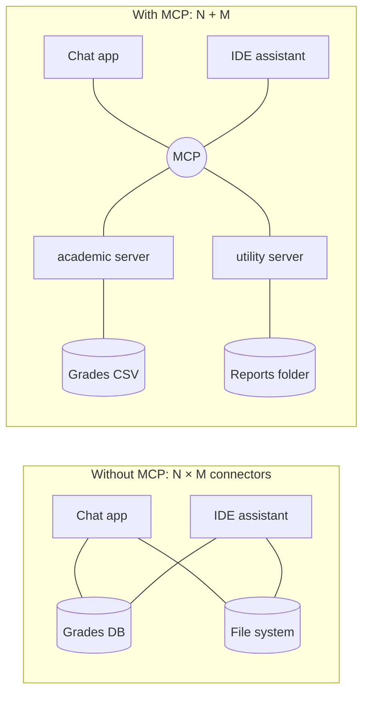
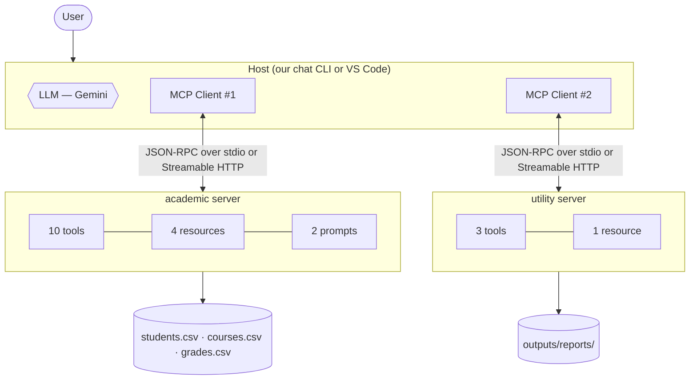
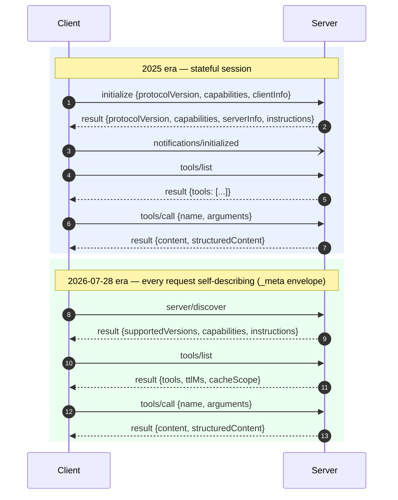
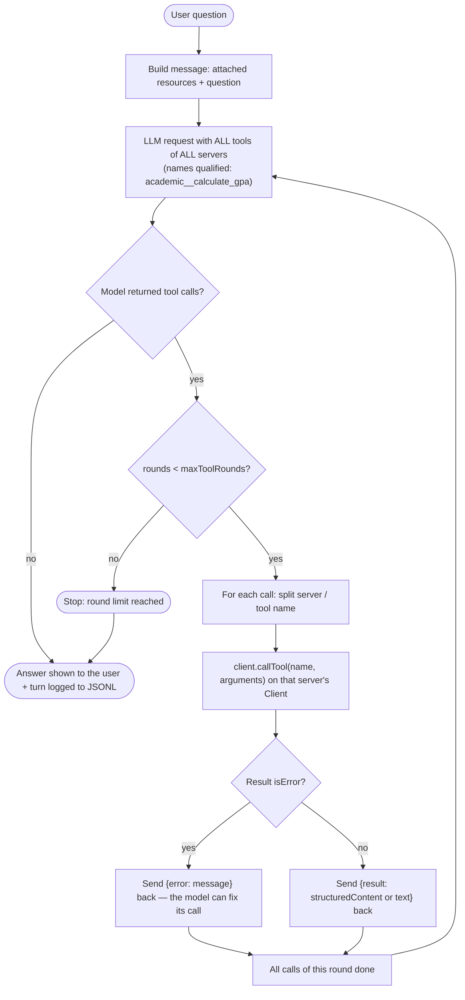
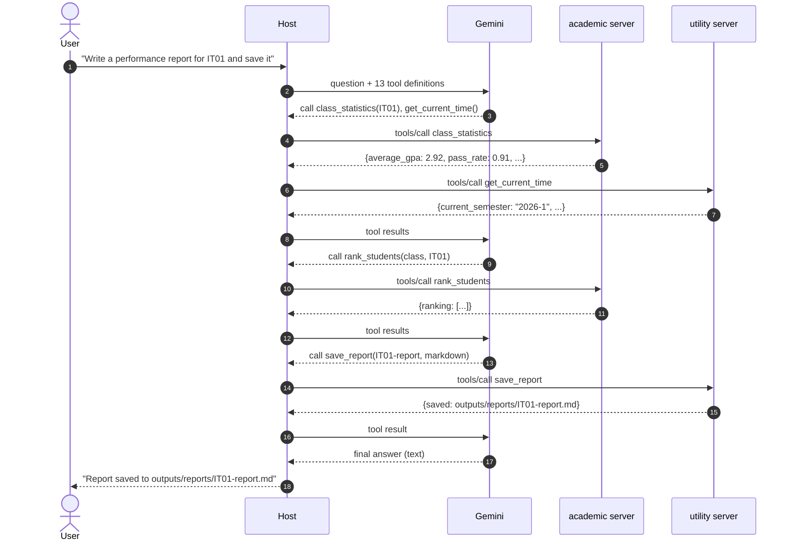
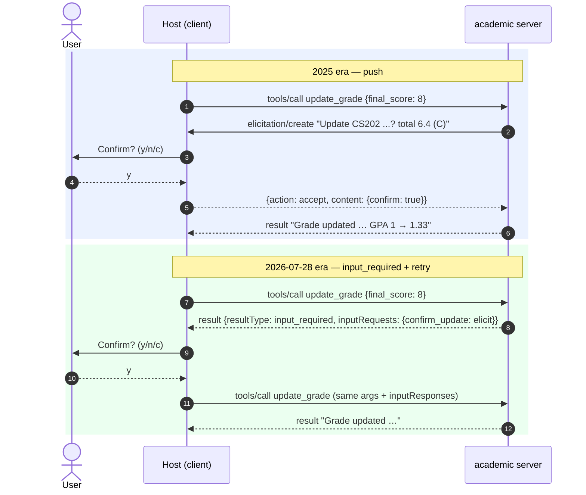
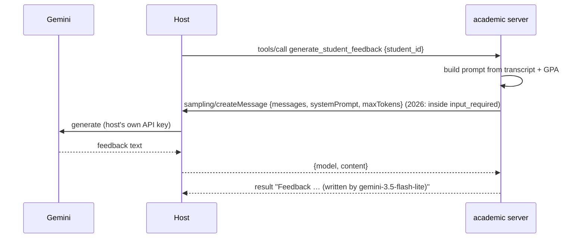
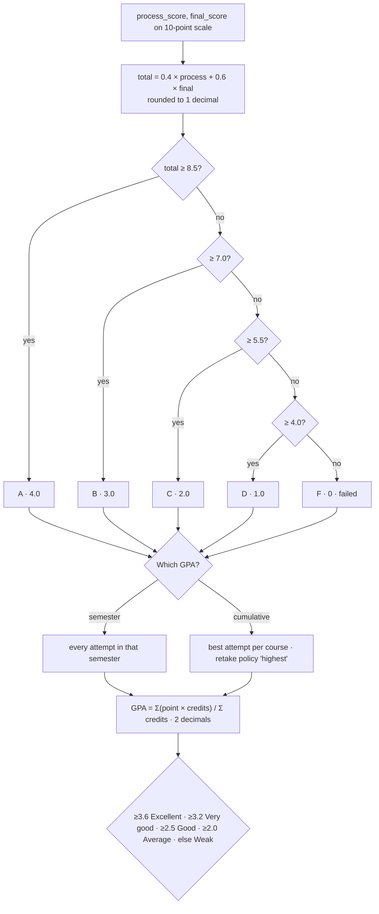
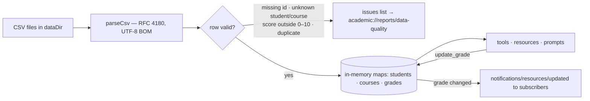

# Architecture, algorithms and flowcharts

Diagrams are written in Mermaid: paste a block into <https://mermaid.live> to export PNG/SVG for the slides, or redraw them in draw.io. Every diagram describes code that exists in this repository; the file that implements each step is named next to it.

---

## 1. The problem MCP solves

Without a standard, every AI application writes its own connector for every data source (**N apps × M sources** connectors). MCP defines one protocol: each source is wrapped once as an **MCP server**, and every MCP-capable application (**host**) can use it (**N + M**).

## 2. Roles in this project

| Role | What it is | Here |
| --- | --- | --- |
| **Host** | The application the user talks to; it owns the LLM | Our chat host (`src/host/`), VS Code |
| **Client** | One connection from the host to one server (`@modelcontextprotocol/client`) | One `Client` per server in `src/host/mcp-hub.ts` |
| **Server** | Exposes tools, resources and prompts (`@modelcontextprotocol/server`) | `academic`, `utility` |
| **LLM** | Decides which tool to call and with which arguments | Gemini (`src/host/providers/gemini.ts`) |

**Three server primitives — who decides to use them:**

| Primitive | Controlled by | Example |
| --- | --- | --- |
| Tool | the **model** (LLM picks it) | `calculate_gpa(student_id)` |
| Resource | the **application/user** (attached as context) | `academic://students/2201010` |
| Prompt | the **user** (chosen like a slash command) | `/academic.class_report class_id=IT01` |

## 3. Protocol: JSON-RPC 2.0 and two eras

Every message is a JSON-RPC 2.0 **request** (`id` + `method` + `params`), **response** (`id` + `result` or `error`) or **notification** (`method`, no `id`). Real captured messages: `outputs/examples/c5-wire-trace.json` (example C5).

| | 2025 era | 2026-07-28 era |
| --- | --- | --- |
| Opening | `initialize` + `notifications/initialized` (2 messages) | `server/discover` (1) — 0 with a cached verdict (`prior`) |
| Client identity | once, at initialize | in every request's `_meta` |
| Server asks the client something | pushes `elicitation/create` / `sampling/createMessage` mid-call | returns `input_required`; the client answers and **retries** the call |
| Change notifications | pushed unsolicited; `resources/subscribe` | one `subscriptions/listen` stream with a filter |
| `ping`, `logging/setLevel` | yes | no (logging and sampling deprecated, SEP-2577) |
| Response caching | — | `ttlMs` / `cacheScope` on cacheable results |

Our servers serve **both** eras from the same code (`serveStdio`, `createMcpHandler`; `src/lib/interaction.ts` picks the right mechanism).

## 4. Main algorithm — the host's tool-calling loop

Implemented in `ChatHost.ask()` (`src/host/host.ts`).

(Real run: 4 tool calls, 3 rounds, 5.7 s — the two servers never talk to each other; the LLM combines them.)

## 5. Human in the loop — elicitation (`update_grade`, `save_report`)

The user can **accept**, **decline** or **cancel**; only an accepted, ticked confirmation changes data. In testing this caught a real LLM mistake (it filled `process_score: 0` that the user never asked for).

## 6. Sampling — the server borrows the host's LLM (`generate_student_feedback`)

The server needs no API key — the host decides which model runs and can refuse (`sampling.approval` in `config/host.json`). Sampling is deprecated in 2026-07-28 (servers are advised to call an LLM directly).

## 7. Domain algorithm — from scores to GPA

Implemented in `src/server/academic/grading.ts`; thresholds in `config/grading.json`.

**Worked example (student 2201010, cumulative):** best attempts GE101 C(2)×2, GE102 B(3)×3, CS101 D(1)×3, CS102 C(2)×3, CS201 B(3)×4, CS202 D(1)×3 → (4+9+3+6+12+3)/18 = **37/18 = 2.06 → Average**. Semester 2024-1 alone (F, F, D): (0×2+0×3+1×3)/8 = **0.38 → Weak**.

## 8. Loading and validating the data

The sample data contains 7 deliberately invalid rows; all 7 are detected and reported, none reaches a calculation.
